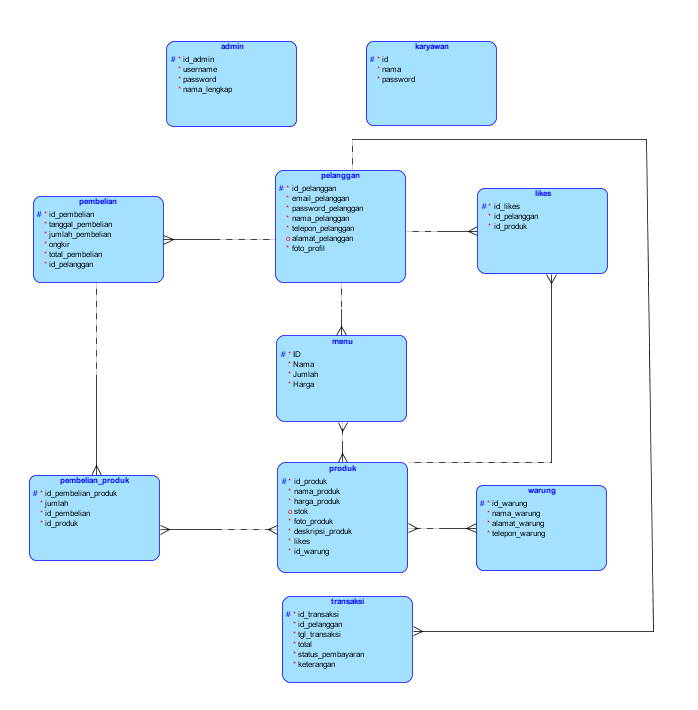

# C2 - Restaurant

# Use Case Diagram :

# ERD :

# Admin
Berikut ini merupakan tampilan dari login admin. Disini admin diminta untuk memasukkan username dan password admin.

Setelah berhasil login, maka akan masuk ke halaman home admin yang menampilkan username admin yang sedang login.

Selanjutnya, terdapat halaman restoran yang berisi data restaurant yang dapat mengubah dan menambahkan restaurant.

Berikutnya terdapat halaman produk yang berisi data menu serta dapat menghapus dan mengubah menu.

# Pelanggan
Berikut ini merupakan tampilan login pelanggan. Disini pelanggan diminta untuk memasukkan email dan passwordnya.

Jika pelanggan belum memiliki akun maka dapat menekan regist terlebih dahulu. Lalu tampilannya akan mengarah ke buat akun seperti berikut.

Jika register berhasil maka akan kembali ke halaman login lagi dan diminta untuk memasukkan email dan password yang telah dibuat, login akan berhasil seperti berikut.

Jika berhasil login tampilan awal yang akan dilihat oleh pelanggan yaitu halaman home seperti berikut.

Pelanggan juga dapat melihat menu yang tampilan halamannya seperti berikut.

Di menu ini kita dapat membeli dan melihat detail dari menu yang ingin kita lihat seperti berikut.

Dan ini akan muncul pemberitahuan seperti ini jika kita berhasil menambahkan menu tersebut ke dalam cart.

Maka anda otomatis akan masuk ke halaman keranjang pesanan seperti berikut.

Selanjutnya, jika pelanggan ingin melanjutkan untuk memesan menu lain lagi maka dapat menekan continue ordered. Namun jika ingin melanjutkan pembayaran maka pelanggan dapat menekan processing ordered.

Jika menekan processing ordered maka akan ada detail pembelian dari pesanan kita seperti berikut.

Jika menekan checkout dan pembayaran berhasil, maka pelanggan akan mendapatkan nota yang tampilannya seperti berikut.

Selanjutnya, terdapat juga halaman partners yang tampilannya seperti berikut.

Dan Terdapat halaman contact us yang berisi alamat dan kontak dari restaurant.

# Kasir
Berikut ini merupakan tampilan dari login Cashier. Disini Cashier diminta untuk memasukkan username dan password Cashier.

Setelah berhasil login, maka akan masuk ke halaman home Cashier yang menampilkan username admin yang sedang login.

Selanjutnya, terdapat halaman pembelian yang berisi pembelian data yang dapat dihapus danmelihat detail.

Berikutnya terdapat halaman pelanggan yang berisi akun pelanggan serta dapat dihapus.

